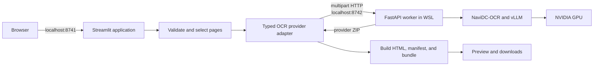

# NaviDC-OCR Document Extraction Studio

Local, GPU-accelerated agentic document extraction for scanned PDFs and images.
The Streamlit workspace turns selected pages into layout-aware Markdown, an
annotated PDF, a self-contained visual HTML document, and a reproducible ZIP
bundle—without sending document content to a cloud OCR service.

**GitHub:** <https://github.com/pypi-ahmad/NaviDC-OCR-Agentic-Document-Extraction>

> [!IMPORTANT]
> This project is designed for one trusted user on the Windows 11 + WSL 2
> machine described below. It is not hardened for public internet deployment.

## Contents

- [What it does](#what-it-does)
- [Quick start](#quick-start)
- [Use the app](#use-the-app)
- [Outputs](#outputs)
- [How it works](#how-it-works)
- [Configuration](#configuration)
- [Technology](#technology)
- [Project structure](#project-structure)
- [Development and validation](#development-and-validation)
- [Documentation](#documentation)

## What it does

- Accepts PDF, PNG, JPG/JPEG, and TIF/TIFF uploads up to 100 MB.
- Validates file type, readability, PDF page count, and page ranges.
- Processes all PDF pages or an inclusive selected range in source order.
- Uses `StarDoc-AI/NaviDC-OCR` for context- and layout-aware extraction.
- Preserves headings, paragraphs, lists, tables, key-value content, and page
  boundaries where the model supports them.
- Shows the source, rendered and raw Markdown, annotated PDF, and visual HTML.
- Packages artifacts, extracted images, provenance, and settings in one ZIP.
- Keeps uploads and request intermediates temporary and local.
- Fails clearly when NaviDC-OCR is unavailable; it never fabricates OCR output.

## Quick start

### Prerequisites

- Windows 11 with WSL 2
- Ubuntu 24.04 registered as `Ubuntu-24.04`
- NVIDIA GPU available inside WSL
- [`uv`](https://docs.astral.sh/uv/) available in PowerShell
- NaviDC-OCR runtime at `/home/ahmad/projects/NaviDC-OCR`

The machine validated for this project uses an RTX 4060 Laptop GPU with 8 GB
VRAM. NaviDC runs with BF16 model weights in its isolated Python 3.12 runtime.

### 1. Install application dependencies

Open PowerShell in the repository root:

```powershell
uv sync --all-groups
```

This creates the lightweight project `.venv`. Do not install NaviDC, Torch,
CUDA, or vLLM into this environment.

### 2. Launch

Double-click `launch.cmd`, or run:

```powershell
.\launch.cmd
```

### 3. Open the workspace

Open <http://localhost:8741>.

The OCR worker starts when the first extraction begins. Initial model loading
can take several minutes; later requests reuse the loaded worker.

> [!TIP]
> Follow the [first-extraction tutorial](docs/tutorial-first-extraction.md) to
> process the included `input/navidc-smoke-test.pdf` sample.

## Use the app

1. Upload a supported PDF or image from the sidebar.
2. For a PDF, choose inclusive start and end pages.
3. Keep **Detection** selected for the first attempt.
4. Select **Extract document** and wait for all artifact stages to complete.
5. Review the annotated PDF and raw Markdown against the source.
6. Download the ZIP bundle before changing the file, range, or layout mode.

Images are treated as one-page documents. For TIFF files, only the first frame
is processed.

For difficult scans, see [How to improve extraction accuracy](docs/how-to-improve-accuracy.md).

## Outputs

| Artifact | Filename | Purpose |
|---|---|---|
| Markdown | `<source>.md` | Layout-aware text with `<!-- Page N -->` boundaries |
| Annotated PDF | `<source>_annotated.pdf` | Detected regions, labels, and reading order |
| Visual HTML | `<source>_view.html` | Embedded source pages with selectable OCR overlays |
| Bundle | `<source>_extraction_bundle.zip` | All artifacts, `manifest.json`, and extracted images |

The HTML artifact is standalone: it embeds page images, escapes OCR text, uses
no JavaScript, and requires no external assets.

The manifest records the source filename and type, original SHA-256 digest,
source page count, selected range, artifact names, UTC generation time, OCR
provider, model, and layout mode.

## How it works



The two-process design keeps the current Streamlit environment separate from
the validated GPU stack. The worker processes one extraction at a time to
protect the 8 GB GPU, while the loaded model remains reusable across Streamlit
reruns.

Read the [architecture explanation](docs/architecture.md) and
[runtime-isolation decision](docs/adr/001-isolated-ocr-worker.md) for details.

## Configuration

### Application defaults

| Setting | Value |
|---|---|
| Streamlit URL | `http://localhost:8741` |
| Provider URL | `http://127.0.0.1:8742` |
| Upload limit | 100 MB |
| Default layout mode | `Detection` |
| Large-range warning | More than 25 selected pages |

### Worker defaults

| Setting | Value |
|---|---|
| Model | `StarDoc-AI/NaviDC-OCR` |
| Backend | `vllm-async-engine` |
| Precision | BF16 in the validated runtime |
| Maximum model length | 8192 tokens |
| GPU memory utilization | 0.85 |
| PDF workers | 1 |

### Environment variables

Defaults work on the configured machine. Override them before launching only
when the local runtime or provider address differs:

```powershell
$env:NAVIDC_RUNTIME_DIR = "/home/ahmad/projects/NaviDC-OCR"
$env:NAVIDC_PROVIDER_PORT = "8742"
$env:NAVIDC_PROVIDER_URL = "http://127.0.0.1:8742"
.\launch.cmd
```

Keep `NAVIDC_PROVIDER_PORT` and the port in `NAVIDC_PROVIDER_URL` consistent.
No credential is required for the downloaded public model.

> [!NOTE]
> PP-LayoutV3 is not required. NaviDC-OCR provides its own layout analysis.
> Adding a second layout engine would create a separate, unvalidated pipeline.

See the full [configuration and artifact reference](docs/configuration-and-artifacts.md).

## Technology

| Layer | Technology |
|---|---|
| User interface | Streamlit 1.62+ with native PDF rendering |
| Application | Python 3.12+; Python 3.14.7 selected locally |
| Document processing | PyMuPDF 1.28+, Pillow 12.3+ |
| Provider client | HTTPX 0.28+ |
| Local API | FastAPI and Uvicorn in the NaviDC environment |
| OCR inference | NaviDC-OCR, PyTorch, Transformers, and vLLM |
| Packaging and tools | `uv`, Ruff, ty, and pytest |
| Accelerator | NVIDIA CUDA through WSL 2 |

Exact application versions are locked in `uv.lock`. The NaviDC runtime is
intentionally managed separately.

## Project structure

```text
.
├── streamlit_app.py                  # Streamlit entry point and result UI
├── launch.cmd                        # Windows launcher for port 8741
├── src/agentic_document_extraction/
│   ├── documents.py                  # Validation, normalization, page selection
│   ├── provider.py                   # Worker lifecycle and typed HTTP adapter
│   ├── worker.py                     # FastAPI and NaviDC execution boundary
│   └── artifacts.py                  # HTML, manifest, filenames, and ZIP
├── tests/test_core.py                # Focused deterministic tests
├── docs/                             # Tutorials, guides, reference, explanations
├── research/                         # Source-grounded research reports
├── knowledge-base/                   # Curated NaviDC and LandingAI ADE material
├── input/                            # Local smoke-test input
├── output/                           # Existing smoke-test evidence
├── pyproject.toml                    # Dependencies and tool configuration
└── uv.lock                           # Reproducible application dependency lock
```

## Development and validation

Synchronize all dependencies, including the development group:

```powershell
uv sync --all-groups
```

Run the application directly when you need Streamlit arguments:

```powershell
uv run streamlit run streamlit_app.py --server.port 8741
```

Run the checked quality gates:

```powershell
uv run pytest
uv run ruff format --check src tests streamlit_app.py
uv run ruff check src tests streamlit_app.py
uv run ty check src
```

The tests cover inclusive page-range validation, selected-page order, and ZIP
manifest composition. Provider changes should also be verified with one real
GPU extraction using `input/navidc-smoke-test.pdf`.

Read [CONTRIBUTING.md](CONTRIBUTING.md) before changing code and
[SECURITY.md](SECURITY.md) before changing persistence or network exposure.

## Documentation

Documentation follows the Diátaxis model:

| Need | Start here |
|---|---|
| Learn the workflow | [First-extraction tutorial](docs/tutorial-first-extraction.md) |
| Solve an OCR-quality problem | [Accuracy guide](docs/how-to-improve-accuracy.md) |
| Operate or troubleshoot services | [Operations runbook](docs/operations-runbook.md) |
| Look up settings or outputs | [Artifact reference](docs/configuration-and-artifacts.md) |
| Integrate with the worker | [Provider API](docs/provider-api.md) / [OpenAPI](docs/openapi.yaml) |
| Understand the design | [Architecture](docs/architecture.md) |
| Browse everything | [Documentation index](docs/README.md) |

The source code is authoritative if documentation and behavior differ.
