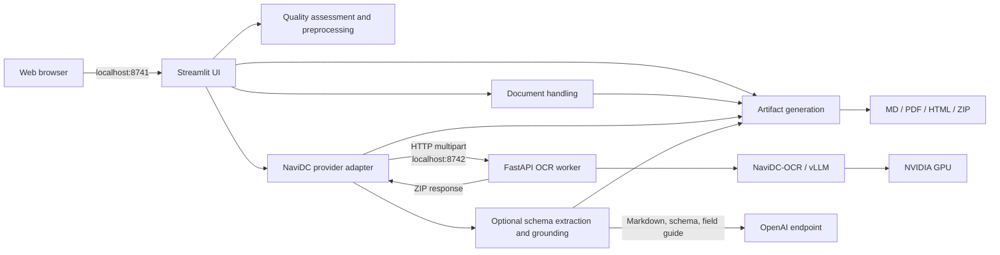
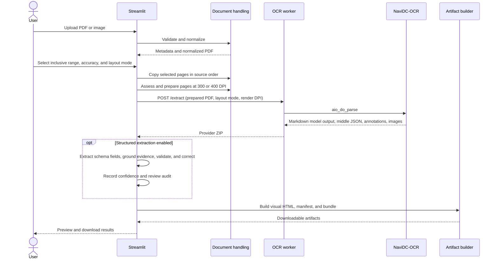

# Architecture

## System purpose

The application converts a scanned PDF or image into four local artifacts:

1. Layout-aware Markdown
2. A PDF annotated with OCR regions and reading order
3. A standalone HTML view rendered from the extracted Markdown
4. A ZIP bundle containing the artifacts, extracted images, and a manifest

The OCR and source-document processing remain local. When the user enables optional
structured extraction, the confirmed schema, optional field guide, and extracted
Markdown are sent to the environment-configured OpenAI endpoint; source PDFs and
images are not sent.

## Component map

[Open the interactive component map](diagrams/application-components.html).

## Modules

| Module | Responsibility |
|---|---|
| `streamlit_app.py` | Page configuration, sidebar controls, previews, progress, result tabs, session state, and downloads |
| `documents.py` | Upload validation, PDF inspection, image-to-PDF normalization, inclusive page selection, safe filenames, and preview rendering |
| `provider.py` | Typed provider boundary, worker lifecycle, health checks, HTTP request, timeout handling, and provider ZIP parsing |
| `worker.py` | FastAPI endpoints, fixed NaviDC configuration, GPU request serialization, OCR execution, and result packaging |
| `quality.py` | Scan assessment, 300/400 DPI rendering, conservative preprocessing, and Auto layout recommendation |
| `schemas.py` | Built-in templates, visual-builder compilation, validation, and schema limits |
| `semantic.py` | Optional schema generation, semantic extraction, bounded correction, and manual review audit |
| `grounding.py` | Evidence-block construction and source quote/region resolution |
| `validation.py` | JSON Schema, format, and cross-field validation with confidence scoring |
| `models.py` | Typed quality, evidence, schema, field, and review results |
| `artifacts.py` | Artifact names, manifest, standalone HTML, and final ZIP packaging |

## Runtime separation

The system uses two Python environments:

| Process | Environment | Reason |
|---|---|---|
| Streamlit | Repository `.venv`, managed by `uv` | Small, current application environment without GPU libraries |
| OCR worker | `/home/ahmad/projects/NaviDC-OCR/.venv` in WSL | Python 3.12 environment containing NaviDC-OCR, PyTorch, CUDA, and vLLM |

On Windows, the provider adapter converts the repository `src` path with `wslpath` and adds it to the worker's `PYTHONPATH`. The worker can therefore load the adapter module without installing the Streamlit project into the NaviDC environment.

## Extraction sequence

[Open the interactive extraction sequence](diagrams/extraction-sequence.html).

## Data lifecycle

- Streamlit reads the uploaded bytes into the active session.
- Images are normalized to a one-page PDF in memory. For TIFF, only the first frame is used.
- Only selected PDF pages are sent to the worker.
- The worker creates a request-scoped temporary directory.
- The worker returns an in-memory ZIP and deletes its temporary directory when the request ends.
- Final artifacts remain in Streamlit session state until the selection changes or the session ends.
- The application does not implement persistent upload or result storage.

## Concurrency and capacity

An `asyncio.Lock` in the worker permits one active extraction at a time. This prevents simultaneous vLLM jobs from competing for the machine's 8 GB GPU. Requests may wait behind an active extraction.

The UI warns for selections above 25 pages, but does not reject them. Actual capacity depends on page complexity, scan resolution, and available GPU memory.

## Security boundaries

- The OCR worker explicitly binds to `127.0.0.1`. Streamlit exposure follows its server binding configuration; use the application only on a trusted local network unless `server.address` is restricted.
- The UI limits uploads to 100 MB and validates the file with PyMuPDF or Pillow.
- Password-protected and zero-page PDFs are rejected.
- Provider errors shown to users are bounded and do not include stack traces.
- Generated HTML escapes OCR content and includes a restrictive Content Security Policy.
- Local OCR requires no credential. Optional structured extraction reads
  `OPENAI_API_KEY` and `OPENAI_BASE_URL` from the environment; values are not
  displayed or persisted.
- Temporary OCR files are request-scoped.

This is a single-user local application. It does not implement authentication, authorization, rate limiting, or hostile multi-tenant isolation.

## Known constraints

- The worker model configuration is fixed at process startup.
- The provider API is local and intentionally not a public network API.
- A failed worker writes no result artifact; there is no synthetic OCR fallback.
- HTML preserves Markdown structure, tables, reading order, and page boundaries in a document-style view. It does not embed the source PDF.
- OCR accuracy remains dependent on the source scan and model behavior.
